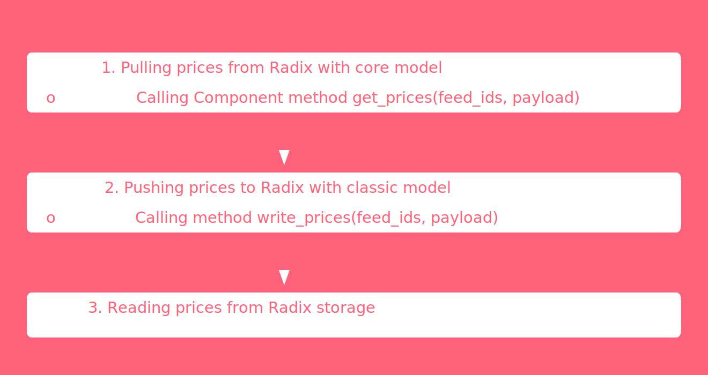

## TypeScript environment

1. Install the dependencies

```shell
yarn install
```

2. Copy [`.env.example`](../.env.example) to `.env` and fill the `PRIVATE_KEY` value in the [`.env`](../.env) file.

## Using the PriceAdapter package

### Deploying package

1. The package can be deployed by using the following command, defined [here](../scripts/sample_deploy.ts):

```shell
yarn sample-deploy
```

2. The deployed [`package.stokenet.addr`](../scrypto/price_adapter/package.stokenet.addr) address can be found in the
   [`price_adapter`](../scrypto/price_adapter)
   directory.
3. The script uses [`RadixPackageDeployer`](../scripts/RadixPackageDeployer.ts) 
with the [`@atlantis-l/radix-tool`](https://github.com/atlantis-l/Radix-Desktop-Tool) package under the hood,
as the Radix Desktop Tool uses.

### Instantiating component

1. The component can be instantiated by using the following command, defined [here](../scripts/sample_instantiate.ts):

```shell
yarn sample-instantiate
```

2. The deployed [`component.stokenet.addr`](../scrypto/price_adapter/package.stokenet.addr) address can be found in the
   [`price_adapter`](../scrypto/price_adapter)
   directory.
3. The script uses [`PriceAdapterRadixContractDeployer`](../src/contracts/price_adapter/PriceAdapterRadixContractDeployer.ts)

### Sample run

1. The scenario above can be run by using the following command, defined [here](../scripts/sample_run.ts):
2. The script uses [`PriceAdapterRadixContractConnector`](../src/contracts/price_adapter/PriceAdapterRadixContractConnector.ts)

```shell
yarn sample-run
```
