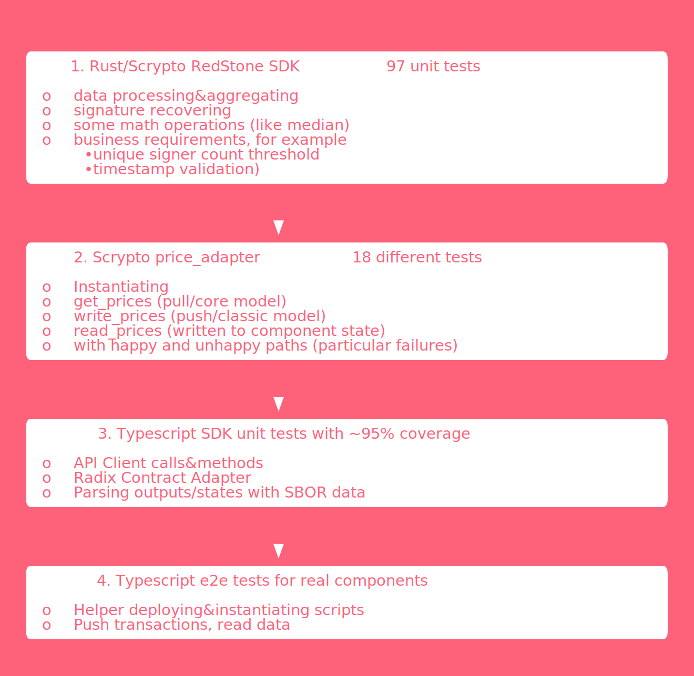

1. Rust/Scrypto RedStone SDK tests

```shell
make -C ../scrypto/rust-sdk test
```

2. Scrypto Price Adapter tests

```shell
make -C ../scrypto test
```

3. Typescript SDK tests

```shell
yarn test
```

4. Typescript e2e tests (deployed component)

```shell
yarn test-e2e
```

5. Typescript SDK coverage

To be found [here](../coverage/)

```shell
yarn coverage
```
